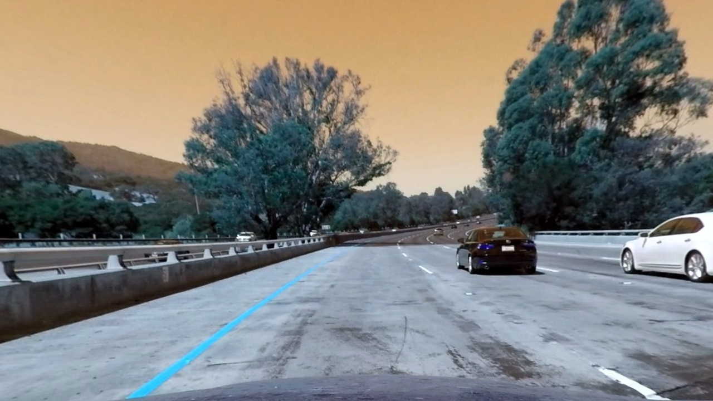
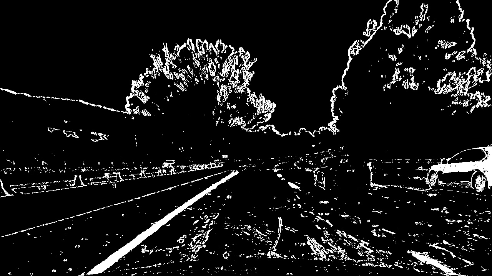
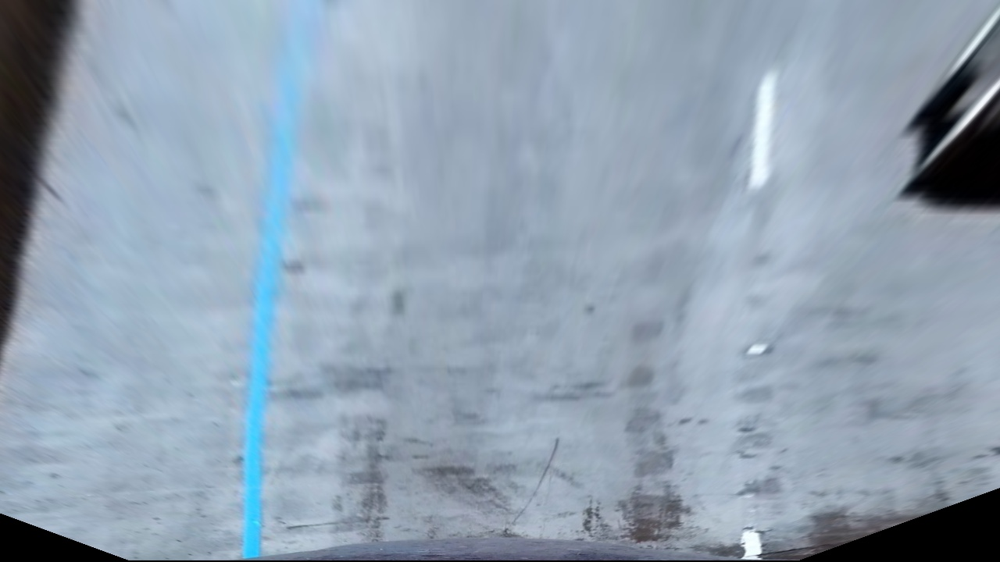
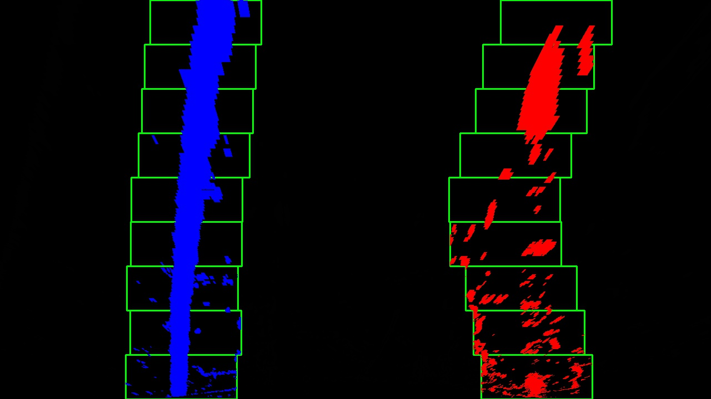

## Writeup Template

### You can use this file as a template for your writeup if you want to submit it as a markdown file, but feel free to use some other method and submit a pdf if you prefer.

---

**Advanced Lane Finding Project**

The goals / steps of this project are the following:

* Compute the camera calibration matrix and distortion coefficients given a set of chessboard images.
* Apply a distortion correction to raw images.
* Use color transforms, gradients, etc., to create a thresholded binary image.
* Apply a perspective transform to rectify binary image ("birds-eye view").
* Detect lane pixels and fit to find the lane boundary.
* Determine the curvature of the lane and vehicle position with respect to center.
* Warp the detected lane boundaries back onto the original image.
* Output visual display of the lane boundaries and numerical estimation of lane curvature and vehicle position.

[//]: # (Image References)

[image1]: ./examples/undistort_output.png "Undistorted"
[image2]: ./test_images/test1.jpg "Road Transformed"
[image3]: ./examples/binary_combo_example.jpg "Binary Example"
[image4]: ./examples/warped_straight_lines.jpg "Warp Example"
[image5]: ./examples/color_fit_lines.jpg "Fit Visual"
[image6]: ./examples/example_output.jpg "Output"
[video1]: ./project_video.mp4 "Video"

## [Rubric](https://review.udacity.com/#!/rubrics/571/view) Points

### Here I will consider the rubric points individually and describe how I addressed each point in my implementation.  

---

### Writeup / README

#### 1. Provide a Writeup / README that includes all the rubric points and how you addressed each one.  You can submit your writeup as markdown or pdf.  [Here](https://github.com/udacity/CarND-Advanced-Lane-Lines/blob/master/writeup_template.md) is a template writeup for this project you can use as a guide and a starting point.  

My all code is in `project-2.ipynb` file.

### Camera Calibration

#### 1. Briefly state how you computed the camera matrix and distortion coefficients. Provide an example of a distortion corrected calibration image.

I start by preparing "object points", which will be the (x, y, z) coordinates of the chessboard corners in the world. Here I am assuming the chessboard is fixed on the (x, y) plane at z=0, such that the object points are the same for each calibration image.  Thus, `objp` is just a replicated array of coordinates, and `objpoints` will be appended with a copy of it every time I successfully detect all chessboard corners in a test image.  `imgpoints` will be appended with the (x, y) pixel position of each of the corners in the image plane with each successful chessboard detection.  

I create a function `cal_undistort()` which takes parameter "img, objpoints, imgpoints". I then put the output `objpoints` and `imgpoints` parameter in this function to compute the camera calibration and distortion coefficients using the `cv2.calibrateCamera()` function.  I applied this distortion correction to the test image using the `cv2.undistort()` function and obtained this result: 

Original Image:

Transformed Image after apply camera calibration and undistort:

### Pipeline (single images)

#### 1. Provide an example of a distortion-corrected image.

I did distort correction using `cv2.undistort()` function and get coefficient using calibrate the camera. In my file, code is like below:
`ret, mtx, dist, rvecs, tvecs = cv2.calibrateCamera(objpoints, imgpoints, img.shape[1::-1], None, None)`

To demonstrate this step, I will describe how I apply the distortion correction to one of the test images like this one:
Original Image:

Transformed Image after distort correction:

#### 2. Describe how (and identify where in your code) you used color transforms, gradients or other methods to create a thresholded binary image.  Provide an example of a binary image result.

I used a combination of color and gradient thresholds to generate a binary image (thresholding steps at lines #1 through #87 in `project-2.ipynb` in cell `Image Thresholding`).
Steps:
a) Undistort the image
b) Calculate the gradx and grady using thresh min and thresh max values. In my code I put the values 5 and 100 for x and 30 and 100 for y
c) Get the magnitude of the gradient and create a binary image of ones where threshold is met, zeros otherwise
d) Gradient direction threshold 
    `dir_binary = dir_threshold(undist, sobel_kernel=21, thresh=(-1.3,1.3))`
d) Get the hls using `cv2.cvtColor()` function and get thresholds the S-channel of HLS by defined a function with different threshold and different channel indexes. code..
    `hls = cv2.cvtColor(undist,cv2.COLOR_RGB2HLS)
    H_th = hls_select(hls,0,(5,50))
    S_th = hls_select(hls,2,(100,255))
    L_th = hls_select(hls,1,(0,101))`
e) Combined the binary as H and S threshold can easily identify the lane lines in different scenario(dark and bright).

Exmple of image thresholding

#### 3. Describe how (and identify where in your code) you performed a perspective transform and provide an example of a transformed image.

The code for my perspective transform includes a function called `corners_unwrap()`, which appears in lines 1 through 26 in the file `project-2.ipynb` in the cell `Perspective Transformation`.  The `corners_unwrap()` function takes as inputs an image (`threshold_image`). I am definying the source (`src`) and destination (`dst`) points in this functions to get best results.  I chose the hardcode the source and destination points in the following manner:

| Source        | Destination   | 
|:-------------:|:-------------:| 
| 560, 470      | 310, 0        | 
| 720, 470      | 910, 0        |
| 1120, 725     | 910, 720      |
| 210,725       | 310, 720      |

`src = np.float32([[560, 470],[720, 470],[1120, 725],[210,725]])`
`dst = np.float32([[310,0],[910,0],[910,720],[310,720]])`

I verified that my perspective transform was working as expected by drawing the `src` and `dst` points onto a test image and its warped counterpart to verify that the lines appear parallel in the warped image. The output folder is located in `test_images_output/birds-eye-view`. An example is given below:

#### 4. Describe how (and identify where in your code) you identified lane-line pixels and fit their positions with a polynomial?

Two functions are used identifying the lane-line pixels and fit their positions with a polynomial.
`find_lane_pixels()`, This function code is given in cell `Finding the Lines: Sliding Window` from line #1 to #81 in the file `project-2.ipynb`. We call this function to get the lane line pixels from perpective transfomred thresholded image. Take a histogram of the bottom half of the image and create an output image to draw on and visualize the result. Find the peak of the left and right halves of the histogram, these are the starting point for the left and right lines. After many steps, we extract left and right line pixel positions.

`fit_polynomial()`, This function code is given in cell `Finding the Lines: Sliding Window` from line #84 to #112 in the file `project-2.ipynb`. This function is used to fit polynomial over lane line pixels.

Example image:

#### 5. Describe how (and identify where in your code) you calculated the radius of curvature of the lane and the position of the vehicle with respect to center.

I did this in a function named `compute_curvature()` that is available at lines #100 through #107 in my code file `project-2.ipynb` in `Final Pipeline` cell. The function computes the radius of curvature in meters. The radius of curvature is calculated using the formula discussed in lessons. The vehical position calculation code is given in lines #1 through #4 in the same file in `Computing offset value` cell. Vehical position is calculated by difference between the center of the image and center of the lane converted to meters `xm_per_pix = 3.7/700`.

#### 6. Provide an example image of your result plotted back down onto the road such that the lane area is identified clearly.

I implemented this step in function `detecting_lane_lines()` in `Final Pipeline` cell and can be found in lines #109 through #175 in my code in `project-2.ipynb`.  The complete pipeline has below steps:
a) Undistort the inputed image.
b) Get threshold image using `combine_binary()` function.
c) Apply perspective transformation on threshold image and get bird view image.
d) Get the lane lines using `find_lane_pixels()` function that is basically sliding window method to get pixels
e) To obtain better solution for videos, checking if lane was detected in last frame. If it is exists, finding the nearby lane lines using `search_around_poly()` function. This function can found in same file in lines #53 through #80 in `Final Pipeline` cell.
f) This detected area is filled with colored polygon by given color (0,255,0). This code is given in function `draw_around_poly()` and this is called by `detecting_lane_lines()` to draw the polygon. This function can be found in same file from line #82 to #91 in `Final Pipeline` cell.

Here is an example of my result on a test image:

---

### Pipeline (video)

#### 1. Provide a link to your final video output.  Your pipeline should perform reasonably well on the entire project video (wobbly lines are ok but no catastrophic failures that would cause the car to drive off the road!).

Here's a [link to my video result](.test_video_output/project_video.mp4)

---

### Discussion

#### 1. Briefly discuss any problems / issues you faced in your implementation of this project.  Where will your pipeline likely fail?  What could you do to make it more robust?

Although this solution works well with project video, but when we go to challenging video, it fails with several conditions like, darker road can be detected as lane, more shiny/bright road can be detected as a different lane and it distort in some areas for a while. Some more calculations could be refine to get this more robust like better detection of perspective transformation or better threshold so that lane line pixel can be detected better in light and dark conditions.
